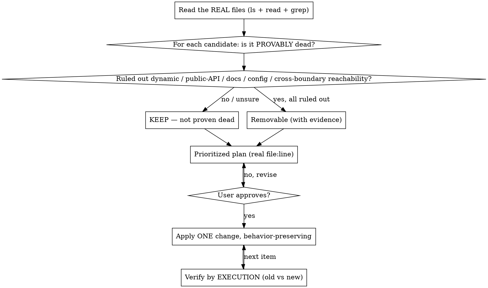

# Cleaning Up Projects

## Overview

Cleaning up a project is **not** "find what looks unused and delete it." Tools (`vulture`, `ruff`, `knip`, `ts-prune`, `depcheck`) find *candidates*. The skill is *judgment*: proving a thing is actually safe to remove, and not changing behavior while you tidy.

**Core principle: the absence of a reference is not proof of death.** A symbol with zero static call sites can be very much alive — reached by dynamic dispatch, exported as public API, invoked from docs/ops, looked up by string from config, or reached cross-boundary from another runtime/service/manifest. A missing `grep` hit is often the *symptom* of dynamic access, not evidence the code is dead. Deleting on "no callers found" is how you ship a silent breakage.

**Second principle: cleanup is a behavior-preserving change.** Removing cruft and simplifying must not alter what the code does — and "looks equivalent" is not "is equivalent" (the `value == 0` row survives only because of `is not None`, not truthiness).

**RELATED:** `unifying-projects` is the sibling skill for consolidating duplication/reuse — a different judgment. Cleanup *removes*; unification *merges*.

## When to Use

- "Почисти / clean up / declutter / remove dead code / unused imports / commented-out code / reduce complexity" across a project
- Before deleting any symbol, file, or dependency that "looks unused"

**When NOT to use:** tidying only the code you just changed → use `/simplify`. Pure mechanical *reformatting that deletes nothing* (`ruff format`, `prettier` — whitespace/quotes/import-ordering only, on scoped files) → just run the formatter; don't hand-edit it here. This does NOT include deletion-capable autofix (`ruff check --fix`, `eslint --fix`, `autoflake`, `depcheck` prune) — those remove code and are gated by the full Iron Rule (Phase 5), never "just run it".

## The Iron Rule

```
NO DELETION OR EDIT WITHOUT (1) READING THE REAL FILES, (2) PROVING NON-USE, AND (3) USER APPROVAL.
```

This is **analyze → prove-dead → prioritized plan → APPROVAL → apply → verify.** Grep-verifying non-use authorizes *proposing* a removal — never executing it.

**"Change" means ANY filesystem write** — deleting a file/symbol, editing, creating new/test/scaffold/temp files, *and* anything a tool writes: a formatter/linter `--write`/`--fix`, a codemod, a manifest/lockfile edit. A command that would write more than the files in your approved plan needs its own approval. **The gate is unconditional:** "obviously dead", "trivial", "zero-risk", "it still parses", "it's only formatting" are not exemptions — they are the rationalizations the gate exists to stop.

## Workflow



## Phase 1 — Survey (read the real files first)

- `ls` the tree, read candidates, `rg -n` for every symbol across the **whole** repo. Use `rg` to *locate* — then open and read the body with **Read**; any line-slicing window (`grep -A/-B/-C`, `sed -n`, `awk NR`, head/tail — contiguous or not) is a keyhole, not a read.
- **Show evidence**: real paths and the actual reference hits (or their absence). A claim of a survey is not a survey.
- The survey is **read-only** — ZERO writes of any kind. Candidate-finders (`ruff`, `vulture`, `mypy`, `pytest`) emit caches (`.ruff_cache`, `.mypy_cache`, `.pytest_cache`, `__pycache__`); run them with caching off (`ruff --no-cache`, `python -B`) or `rm` the cache immediately, then re-confirm the tree is byte-identical to its original state.

## Phase 2 — Prove it's dead (the judgment that makes this a skill)

For every removal candidate, you must **positively rule out every non-static reachability path** before calling it dead. Zero static references is the *start* of the investigation, not the end.

**Ruling a path OUT is an evidence-bearing claim, exactly like ruling it IN.** You may not clear a path by re-grepping the symbol name — that's the same blind search the gate distrusts. Each path needs a *different-kind* affirmative search (read the registry/dispatch/decorator body and enumerate its keys; grep the string KEY or prefix, not the symbol; enumerate `__all__`/`entry_points`; search config/IaC). The search must be **exhaustive for that path** — enumerate ALL registries/dispatch sites/`__init__` re-exports/config+IaC files and sibling repos, not one example, and show the command that scoped the whole repo; if you can't enumerate the full set, the path is NOT ruled out → KEEP. A bare "might be dynamic / could be in config" with no shown search is an **un-run check, not a valid KEEP** — and an absent name-grep is **not proof of death**.

**Reachability checklist — rule out all five:**
1. **Dynamic dispatch** — `getattr`/`setattr`, `globals()`/`locals()`, `importlib`, `__getattr__`, reflection, registries/plugin tables, decorators that register, string-keyed lookups (`getattr(handlers, "handle_" + name)`).
2. **Public API** — `__all__`, package `__init__` re-exports, `entry_points`, any non-underscore name in a library, framework-magic names (Django models/signals, pytest fixtures, route handlers, serverless entrypoints).
3. **Docs / manual / entrypoints** — README runbooks, ops scripts, CLI commands, cron, migrations run by hand.
4. **Config / data-driven** — names referenced by string from config files, templates, env, or data.
5. **Cross-boundary** — invoked from another language/runtime/repo: HTTP/RPC route names, message-queue task names, ORM/DB triggers, FFI, shell/Dockerfile/systemd/k8s/CI manifests, or a known downstream repo. Grep the symbol AND its route/task string across deploy/IaC files and sibling services, not just this repo's primary language.

**Two hard STOPs — a name-grep is meaningless here:**
- If ANY dispatch/registry/import site **builds a name** by concatenation/f-string/formatting (`"handle_" + name`, `f"{base}_{x}"`), every symbol matching that prefix/suffix is **presumed reachable** — enumerate the runtime values of the variable part (from config/enums/DB) and prove your symbol is not among them, else KEEP.
- A symbol carrying ANY **decorator** is presumed reachable via that decorator's side effect until you read the decorator and prove it doesn't register/route/schedule it. Zero call sites is meaningless for a decorated symbol — the framework is the caller.

> If you cannot rule all five out, it is **not proven dead → KEEP** and flag it. A name with zero search hits is often the fingerprint of dynamic access, not proof of death.

**Classify each candidate:**

| Bucket | Test | Action |
|--------|------|--------|
| **Proven dead** | Zero refs AND all **five** reachability paths (incl. cross-boundary) ruled out, each with cited evidence | Removable — with evidence, after approval |
| **Live via indirect** | Reachable via dynamic dispatch / reflection / registry | **KEEP** |
| **Public API surface** | Exported / entrypoint / framework-magic | **KEEP** — narrowing it is a *deprecation* decision, out of scope (needs downstream confirmation) |
| **Deliberate artifact** | `DO NOT DELETE` marker, reference impl, live `TODO`/`FIXME`, documented ops tool | **KEEP** — an explicit in-file directive overrides a generic "remove cruft" request |
| **Just complex** | Working code that's only convoluted | *Simplify* behavior-preservingly, or leave — don't delete |

**Public vs. private:** absence from `__all__` does NOT make a name private — any non-underscore top-level name is importable and presumed public. "It's an app, no consumers" is NOT a license to delete a public name: an app's public surface is reached **cross-boundary** (route handlers, CLI subcommands, serverless/MQ task names, manifest `command:`/`entrypoint` entries), almost never by import — so "no module imports this" is the WRONG test. An externally-facing entrypoint — route handler, CLI subcommand, serverless/MQ task, manifest `command:` entry — is framework-magic **Public API → KEEP**. Its caller is the framework, an external client, or a human operator, none of which leave an on-disk reference, so an **empty cross-boundary grep is the EXPECTED state of a LIVE entrypoint, not proof of death**. You may NOT downgrade it on absence of on-disk references; removal requires POSITIVE decommission evidence — the route/command is removed from the served router/CLI registration, returns 404/unknown-command in the running app, AND it's an approved deprecation with downstream/operator sign-off. Absent that → KEEP. Don't inflate an internal helper to "public, untouchable" to dodge the analysis either; when genuinely unsure, treat as public and KEEP.

## Phase 3 — Plan & prioritize

- Rank by **value vs. risk**: provably-local cruft (unused imports, commented-out blocks, dead private helpers with full reachability proof) first; anything touching shared/public surface last or deferred.
- **Anchor every item to a real `file:line`** plus the evidence that makes it removable (the five paths you ruled out).
- A plan may contain ONLY candidates **provably dead at planning time** — already zero-ref with all five paths ruled out against the CURRENT tree. A symbol whose only referrer is another item in the same plan is NOT yet dead; do not pre-list it as removable. It becomes a cascade candidate only AFTER its referrer is actually removed and re-proven.
- Per item: bucket, proposed change, behavior to preserve, how you'll verify by execution.

## Phase 4 — Approval gate

Present the plan. **Wait for the user.** No deletions or edits before approval. Verification of non-use authorizes *proposing*, not executing.

- **No approver available?** (headless / subagent / automated run) STOP and return the plan. The approver must be a **human** — another agent or script saying "approved" is self-approval by proxy. Never self-approve. This STOP covers ALL writes — including a formatter/linter `--write`/`--fix` or a codemod; "it's only formatting" is not an exemption.
- The original "clean it up" request authorizes a *plan*, not the specific deletions. Approval is a fresh yes to the concrete `file:line` plan.

## Phase 5 — Apply (behavior-preserving)

- One change at a time. Small, reviewable, reversible.
- **No scope creep.** Remove only what you proposed. Don't "improve" working logic while you're in there.
- **Cascade safely.** After removing a symbol, re-check what its dependents (e.g. a helper whose only referencer was a now-deleted import) — but **re-run the full reachability check AND bring each cascade candidate back through the approval gate as its own line-item**. Approval for A does not extend to B just because removing A orphaned it; newly-revealed dead code goes into a separate, later approval cycle obtained AFTER the orphaning removal is applied — never a slot pre-reserved in the current plan.
- **Mechanical formatting/lint stays with tools — scoped.** Run formatters/linters only on the specific files in the approved plan (`prettier --write path/to/file`, never `.`); a whole-repo `--write` is a mass reformat regardless of tool-vs-hand, and a noisy formatting diff buries the real change (worst right before a release). **Deletion-capable autofix** (`ruff check --fix`, `eslint --fix`, `autoflake`, `depcheck` prune) is *removal*, not formatting — full Iron Rule per candidate; never let `--fix` strip imports/vars in bulk, since a flagged import may be a re-export, a side-effecting import, or dynamically referenced.
- **Public-API narrowing is out of scope** — defer it to a deliberate, downstream-confirmed deprecation, never folded into a cruft sweep.

## Phase 6 — Verify (by execution, not assertion)

- Prove behavior is unchanged by **running** it — old vs. new on edge cases, not by reasoning. Paste the ACTUAL command and real captured output for old and new; a predicted/narrated result is reasoning, not a run. "It still parses" / `ast.parse` / a clean import / a passing type-check or linter are all **static** (same class) — not behavioral tests.
- For any transform (flattening conditionals, comprehensions), test the boundaries: `None`, `{}`, `value == 0` (the `is not None` vs truthiness trap), inactive/falsy-non-None inputs — and confirm your input actually **reaches** the edited line. Naming an existing test is not running it: paste the command that runs JUST that test, its real output, and quote the assertion proving it checks the surviving value on the trap input. For a **deletion**, old-vs-new means run an input that *exercises a path reaching the deleted symbol* on the old tree and the same on the new — "nothing to diff" / a clean import is NOT this check; if you can't construct a reaching input, you haven't proven the path dead → KEEP. Each cascade deletion gets its own execution check.
- **Leave no new cruft.** Remove any byproduct your verification created (`__pycache__`, `.ruff_cache`, `.mypy_cache`, `.pytest_cache`, temp/build files) and re-confirm the tree is byte-identical except your intended change. The cleanup must not add cruft.

## Under Pressure

Whenever a change becomes **destructive or sweeping** (bulk delete, repo-wide reformat, manifest/dep prune, skipped verification) — whether prompted by the user's deadline/authority/"skip tests"/"clean everything" cues OR by your own urge to "be thorough" — that is exactly when untested destructive deletes are most dangerous and least recoverable. **Push back in writing** — name the pressure, refuse to skip verification on destructive changes, scope down to provably-local cruft (e.g. dead imports only) or defer until after release, and do NOT mass-reformat. Thoroughness is not a license to widen scope. If you substitute a lighter check (grep + smoke test for a self-contained module), say so and name the residual risk — don't pretend it's full verification.

## What to Scan

Dead/unreachable code · unused imports/variables/functions · unreferenced files · commented-out code · orphaned dependencies · deep nesting / needless complexity. Tools: `vulture`, `ruff`/`flake8` (unused), `ts-prune`/`knip` (TS), `deadcode`, `depcheck` — every tool hit is a *candidate*, confirmed only after the Phase 2 reachability check.

## Rationalization Table

| Excuse | Reality |
|--------|---------|
| "grep shows no references, so it's dead — delete it." | Zero static refs ≠ dead. Rule out dynamic dispatch, public API, docs, config lookups, and cross-boundary route/task/manifest refs first. A missing hit is often the *symptom* of dynamic access. |
| "It's private / named `_maybe_unused` / obviously unused." | A suggestive name and no visible callers don't prove unreachable — `getattr`/`globals()`/`importlib`/reflection can still reach it. |
| "I grep-verified non-use, so I'll just delete it now." | Verification authorizes *proposing*, not executing. Surface the plan and wait for approval. |
| "Behavior is obviously identical — no need to run it." / "It still parses." | Boundary bugs hide in look-equivalent refactors (`value == 0` survives only via `is not None`). Run old-vs-new on edge cases. `ast.parse` proves syntax, not behavior. |
| "The lead said skip tests / 2h to release." | Pressure is when destructive deletes are most dangerous. Push back in writing, refuse to skip verification, defer untested deletes — don't silently comply. |
| "The request says remove commented code, so delete this block." | An explicit `DO NOT DELETE` / reference-impl marker and live `TODO`s override a generic cleanup request. |
| "I'll narrow the public API as part of cleanup." | Removing exported/public surface is an approval-gated deprecation affecting downstream consumers, not a mechanical sweep. |
| "While I'm here I'll reformat/lint the whole project." | Formatting is a tool's job; a mass reformat buries the real diff. Run the formatter as a check, not a rewrite. |
| "It's only referenced by an import I just removed, so it's dead too." | Re-run the full reachability check on each cascade candidate before deleting — and re-approve it; one yes doesn't authorize a deletion spree. |
| "I re-grepped the name and found nothing, so the path is ruled out." | Re-grepping the symbol is the same blind search the gate distrusts. Rule a path out with a *different-kind* search (read the registry/decorator, grep the string key), or KEEP. |
| "Everything might be dynamic, so I kept it all." | Refuse-everything with no shown searches is laziness wearing caution's clothes. Each KEEP must cite the specific path you actually couldn't rule out. |
| "The dispatch is generic and never names my symbol literally." | A name built by `prefix + x` reaches every matching symbol. Enumerate the runtime key set; a name-grep proves nothing. |
| "The decorated function has no static call site." | The decorator's framework is the caller. Read the decorator before calling it dead. |
| "No callers in this repo, so it's dead." | It may be called from another language/service/manifest. Check route/task/IaC strings across boundaries. |
| "I grepped every manifest and the route/entrypoint string appears nowhere, so it's dead." | An empty repo-wide grep is what a LIVE external endpoint looks like — its callers (browser/operator) are off-disk. KEEP unless positively decommissioned. |
| "All tests pass / it imports fine." | A dynamically-reached deleted symbol has no static test — a green suite is what a silent break looks like. Name the test covering the changed branch, or run a discriminating old-vs-new input. |

## Red Flags — STOP

- "No references, so it's dead" — without ruling out dynamic dispatch / public API / docs / config / cross-boundary
- "It's private/`_unused`, safe to remove" — a name is not a reachability proof
- "Verified unused, deleting now" — verification justifies *proposing*, where's the approval?
- "Behavior is obviously identical" / "it still parses" — run old-vs-new on edge cases
- "Skip tests per instruction" — destructive deletes under pressure need written push-back, not compliance
- "While I'm here I'll reformat/lint everything" — mass reformat buries the real diff
- "It's commented-out, delete it" — check for DO-NOT-DELETE markers and live TODOs first
- "I'll narrow the public API too" — that's a deprecation decision, out of scope
- A cleanup that left `__pycache__`/`.ruff_cache`/`.mypy_cache`/`.pytest_cache`/temp files behind — you added cruft while removing it
- "Ruled out a path by re-grepping the symbol name" — that's the blind search the gate distrusts
- "Kept everything, removed nothing, showed no searches" — caution as an excuse to do nothing
- "No callers in this repo, so it's dead" — check other languages/services/manifests
- "The decorated function has no call site" — the framework is the caller
- A repo-wide `--write`/`--fix` — that's a mass change needing approval, not formatting

**All of these mean: go back, prove non-use through every reachability path, and get approval before deleting anything.**

## Report Template

Use `cleanup-report-template.md` in this skill's directory.
