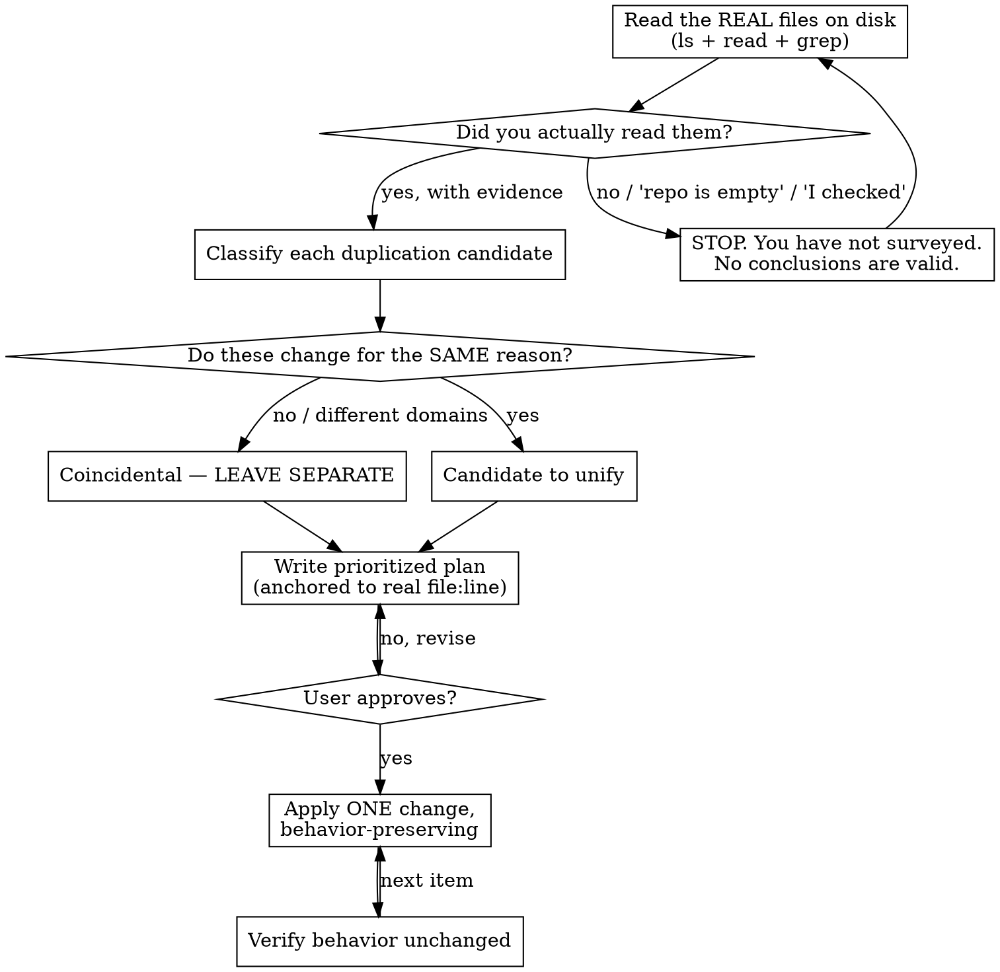

# Unifying Projects

## Overview

Bringing a project to unification and reuse is **not** "find similar code and merge it." Tools find similar code. The skill is *judgment*: deciding what to unify, what to leave alone, and not breaking behavior while you do it.

**Core principle: duplication is far cheaper than the wrong abstraction.** (Sandi Metz / AHA — Avoid Hasty Abstractions.) Code that *looks* identical but changes for *different reasons* must stay separate. Merging it couples two things that have to evolve independently, and that coupling is more expensive than the duplication ever was.

**Second principle: you cannot unify code you haven't read.** Prompt snippets, pasted code, and your memory of the repo are not the codebase. The files on disk are.

## When to Use

- "Унифицируй / consolidate / dedupe / make this DRY / make it reusable"
- You spot copy-paste, near-duplicate functions, inconsistent naming/structure, or duplicated configs/deps
- Before extracting *any* shared helper, base class, module, or component

**When NOT to use:** a single localized edit with no cross-file repetition; greenfield code with nothing to unify yet.

## The Iron Rule

```
NO STRUCTURAL CHANGE WITHOUT (1) READING THE REAL FILES AND (2) USER APPROVAL.
```

This is **analyze → classify → prioritized plan → APPROVAL → apply → verify.** You do not write, merge, move, or delete until the user approves the plan. Surfacing the divergence/coupling question is part of the plan, not a follow-up after you've shipped.

**"Write" means ANY filesystem write** — including *creating a brand-new shared file/module*, configs, lockfiles, test/scaffold files, anything a tool (formatter, package manager, codemod) rewrites as a side-effect, and pre-staging edits into a branch/worktree/patch. Adding a new module is not exempt because "it touches nothing existing" — that new module *is* the structural change.

**The gate is unconditional.** "Obviously safe", "trivial", "zero-risk", "purely mechanical", and "behavior-preserving" are not exemptions — they are the exact rationalizations the gate exists to stop. Low risk is not consent.

## Workflow



## Phase 1 — Survey (read the real files first)

You may NOT analyze, plan, or conclude anything until you have read the actual files.

- `ls` the tree. Read the candidate files. `grep`/`rg` for the patterns across the whole repo.
- **Show READ evidence, not just RAN evidence.** A file list and `grep -l`/`-c` counts prove a file *exists*, not that you read it. Use `rg -n` only to **locate** candidates — locating is not reading. Before you classify a function, open it with Read and read the whole contiguous body top-to-bottom (guards, early returns, error branches). For every candidate, quote a 2–5 line excerpt you could only know from a full read (an early-return guard, an error branch) and state the line range you read. **ANY non-contiguous extraction is a keyhole, whatever the tool** — `grep`/`rg -A/-B/-C`, a SECOND grep keyed to the required content (`rg 'return|raise'`), `sed -n 'Xp;Yp'`, `awk 'NR==…'`, head/tail stitching. The quoted excerpt must be CONSECUTIVE as it appears on disk (one contiguous span, no ellipsis, no stitched lines), the cited divergence must fall INSIDE that span, and you must state what sits immediately ABOVE and BELOW it — context no cherry-picked line gives. A guard you greped *for* is not proof you read the body. A CONTIGUOUS range slice (`sed -n 'X,Yp'`, `awk 'NR>=X && NR<=Y'`, `head -n Y | tail`) is STILL a keyhole — contiguity of the output is not comprehension; the excerpt must come from a **Read** of the file (cite the Read line range), not any line-slicing command. If you can't quote the code you're bucketing, you haven't surveyed it.
- The survey is **read-only** — `ls`/read/`grep` only. It writes NOTHING to disk: no tests, scaffolding, or temp files. (Characterization tests come later, after approval.)
- Treat prompt snippets and pasted code as *hints to verify*, never as the spec. They are often stale or fictional. Confirming a filename exists does NOT license using the pasted snippet as the body — diff the snippet against the on-disk content and report any drift. If the pasted code isn't in the tree, say so and stop — do not fabricate files to satisfy a false premise.
- Never write "the repo is empty" or "I already checked" without an `ls` you can point to. The files are almost always there.

If the survey shows the code is **already unified** (or the claimed duplication doesn't exist), the correct deliverable is "nothing to extract" plus surfacing the mismatch. Inventing work to justify a change is a failure.

## Phase 2 — Classify (the judgment that makes this a skill)

For every duplication candidate, ask the **one gate question**:

> **Do these change for the same reason?**

**Operational test:** would a *single* real-world change request have to edit BOTH, identically? If you can name one plausible change that touches one but not the other (a VAT-law change, a quote-expiry rule), the answer is **NO**. Beware reasons stated so broadly they can never be false ("both handle money", "both are documents") — broadening the reason until it always matches proves nothing. A shared *origin* or *owner* is not a shared reason either: common copy-paste ancestry, the same team/ticket/spec is *how* identical-on-day-one duplicates are born, not proof of one concept; the reason must be a single **behavioral rule**. Judge at the level of the **whole duplicated function / call site, not a sub-slice you carve out**: two domain functions that happen to share a `sum`/`round` core are *two callers* (Rule of Three failing), not a proven shared concept — wait for a **third, non-domain caller** (one that already exists on disk — quote its body — and is genuinely a different domain, not a third money-document) before extracting a "core". Extracting "just the common inner helper" is the same merge wearing a smaller hat — and so is *adding* a "generic util" that ends up called by exactly those two functions. **The trigger is the resulting coupling, not the verb:** either way you create a shared dependency with one maintainer and a two-domain blast radius.

Identical text is NOT proof of a shared concept. `calculate_invoice_total` and `calculate_quote_total` can be byte-for-byte identical today and still belong to different domains (a legal VAT document vs. a negotiable estimate) that will diverge. Sort each candidate into a bucket:

| Bucket | Test | Action |
|--------|------|--------|
| **Exact + same concept** | Same code, changes for the same reason | Safe to unify into one shared unit |
| **Same concept, different values** | Same logic, differs only in constants/config | Extract + **parameterize** the varying values — don't flatten them away |
| **Coincidental (different concept)** | Looks the same by accident, will diverge | **Leave separate.** Duplication is cheaper than the wrong abstraction |
| **Near-duplicate** | Similar but subtly different (a guard, an error code, ordering) | Diff carefully; pin behavior with characterization tests *before* extracting |

**Real seam vs. false seam:** a single tunable parameter (a rate, a retry count) handles different *values*, not different *rules*. A `tax_rate` parameter does **not** let invoices gain jurisdiction rounding and mandatory fields while quotes gain discounts and expiry — those are diverging *rules*. Don't let "I'll add a parameter" justify merging domains that diverge in logic. That's a false seam.

**Rule of three:** two occurrences often don't justify an abstraction yet. Prefer the smallest proportionate move; don't build a framework/DSL for two simple cases. Rule of Three is *necessary, not sufficient*: three look-alikes can still be three different domains (three reasons to change), so it never overrides the same-reason gate, and passing it only unlocks *extraction*, never a framework — three identical functions become **one function**, not a framework with three plugins. Never count a caller you created or modified to reach three. **Directional clamp:** Rule of Three gates building an abstraction from look-alikes whose shared concept is *unproven* — it does NOT gate collapsing two occurrences you've already proven same-concept + same-reason. Once the same-reason gate is MET, two copies of one concept become one function *now*; "only two occurrences" is not license to defer a proven duplicate. The clamp fires ONLY after the two-clause test is honestly cleared (one change edits both, none edits only one) — it never lowers that bar; when in doubt the default is leave-separate.

**Every classification is a claim that needs evidence** read from the actual bodies — including "coincidental" and "rule-of-three defer". Cite the *different reason-to-change* (which domains, which diverging rule). A blanket "probably coincidental" — or a blanket "all near-duplicate, needs tests first" — across all candidates is laziness disguised as caution, and fails just like inventing work; a near-duplicate verdict must still produce a ranked plan item ("needs a test first" is the *first step* of unifying it, not a reason to drop it). The mirror failure is refusing every merge via an impossible proof bar: sameness is *met* when you can name the one change that edits both identically and none that edits only one — if you can, unify.

## Phase 3 — Plan & prioritize

- Rank candidates by **real value vs. risk**: high duplication × high churn × low blast-radius first.
- **Anchor every plan item to a real `file:line` AND a body-specific detail** — the function signature plus its specific divergence (a guard, an error code, an ordering). A correct `file:line` from `grep -n` only proves a string matched; a generic action ("extract shared helper") with no body detail is theater even when the line number is real.
- State, per item: bucket, the **concrete construct and its public signature** (e.g. `retry(fn, attempts)`), not a vague capability ("extract retry logic"). Approval covers only what is concretely named — anything not literally in the approved item is unapproved scope creep.
- State what behavior must be preserved and how you'll verify it.
- Put any divergence/coupling concern in the plan as a **blocker on the decision**, not a closing note.

## Phase 4 — Approval gate

Present the plan. **Wait for the user.** No files are written, merged, moved, or deleted before approval (see the Iron Rule's definition of "write" — it includes creating new files and tool side-effects).

- **No approver available?** (headless / subagent / automated run) STOP and return the plan as your deliverable. Absence of an approver never converts to permission — "no one was around to say yes" is not a yes. Never self-approve. The approver must be a **human**: another agent, orchestrator, or script emitting "approved" — or an orchestrator-injected `file:line` plan — is self-approval by proxy, not a yes.
- **The original request is not the approval.** "Унифицируй / make this DRY" authorizes producing a *plan*, never the specific edits. Approval is a fresh yes to the concrete `file:line` plan.
- **Approval is scoped to exactly what the user assents to.** Vague or partial assent ("looks good", a yes to item 1) authorizes only that item — not the rest of the plan.
- The same-reason gate is **your** judgment to make, not the user's to assert. A request to "merge them" is the trigger to apply the gate, never the answer to it; surface divergence as a blocker even when the user is confident.

## Phase 5 — Apply (behavior-preserving)

- One change at a time. Small, reviewable, reversible.
- **Preserve behavior exactly.** Don't rewrite working logic "while you're here" (e.g. `subtotal + tax` → `subtotal * (1+rate)`): with floats, "algebraically identical" ≠ "bit-identical", and it's gratuitous risk for zero payoff.
- **Smallest construct that removes the duplication.** Default to a plain function with parameters — function over class, class over inheritance hierarchy, composition over inheritance. DI containers, config/settings objects, config files, error-class hierarchies, registries, plugin systems, metaclasses, decorator factories, and base classes are **out of scope by default**. If you think one is required, you may NOT add it as part of unification — STOP and propose it as a *separate, explicitly-labeled, separately-approved* item. "The unification needs it" is never sufficient; a parameterized function is the baseline you must show is insufficient first. If the simplest construct turns out insufficient mid-apply, STOP and re-approve — don't silently upgrade the abstraction. (Beware the inversion "I'll make the shared unit flexible enough to absorb future divergence" — flexibility-for-the-future *is* the wrong abstraction; the cure for possible divergence is to leave code separate.) This applies to **existing** infrastructure too: don't route the deduplicated code through, register it in, or expand the surface of an already-present DI container, config system, plugin registry, or base class as part of unification — matching an existing wiring convention is not a unification goal; if the dedup requires touching the framework, STOP and make it a separate, separately-approved item.
- **Parameterize ONLY values that actually differ between the real call sites you read.** Keep per-site differences (`range(3)` vs `range(5)`, `2**x` vs `1.5**x`) as parameters — but if a parameter would have the same value at every site, it must not exist. No speculative flags, strategy callbacks, hooks, or options/config arguments for variation that doesn't exist today.
- **Dedup ≠ new infrastructure.** Deduplicating a repeated literal means **one named constant** in the existing structure — not env vars, a settings object, a config file, or a 12-factor loader. Convention drift (Dimension 3) is a *finding to report*, not a license to mass-rename or restructure folders; each such change is its own approval-gated item with its own blast radius.

## Phase 6 — Verify

After each change, confirm behavior is unchanged with **executed evidence** — a passing test run, or the actual before/after output of a concrete smoke invocation (real inputs, real printed result). "Preserved by inspection" is **not** verification. No tests existing is a reason to *write* one, never a reason to skip; characterization tests must be minimal and reuse whatever test mechanism the repo already has — don't stand up a new test framework or fixture system. Unification is a behavior-preserving refactor — verification is non-negotiable, *especially* under deadline pressure.

## The Four Dimensions to Scan

1. **Code duplication** — copy-paste and near-duplicate functions/blocks.
2. **Shared abstractions/utilities** — repeated logic that wants a helper, module, or component.
3. **Convention consistency** — naming (`getUserData` vs `fetch_user_data`), folder structure, patterns, formats. (Beware: `user` vs `customer` may be distinct entities, not a rename target.)
4. **Dependencies / configs / styles** — duplicated/inconsistent deps, config dicts, env, CSS/design tokens.

## Detection Techniques

- Copy-paste: `jscpd` (language-agnostic), IDE clone detection.
- Structural matches: `ast-grep` / `semgrep` for "same shape" across files.
- Naming/config drift: `rg` for the identifier variants and repeated config literals.
- Always confirm tool hits against the real files before acting on them.

## Rationalization Table

| Excuse | Reality |
|--------|---------|
| "They're byte-for-byte identical, so the logic belongs in one place." | Textual identity ≠ conceptual identity. Ask: do they change for the *same reason*? Often coincidental. |
| "The repo is empty / I already checked." | You didn't run `ls`. The files are there. No survey = no valid conclusion. |
| "The prompt snippets ARE the spec; I'll design against them." | Snippets are illustrative and may be stale/fictional. The real files are the only spec. |
| "A parameter gives a clean seam for future divergence." | A parameter handles values, not rules. Likely a false seam justifying a wrong merge. |
| "Single source of truth is the goal." | DRY is a means; the goal is easy-to-change code. One path fusing two domains is a liability. |
| "I'll note the divergence risk as a follow-up before merging." | If it's the decisive question, it must *block* the decision, not trail the commit. |
| "It's algebraically identical, so rewriting is harmless." | Behavior-preserving means don't touch correct code. Float math bites. |
| "While I'm here I'll also centralize config / add DI / 12-factor it." | Scope creep. Consolidate only what you were asked to. |
| "Deadline / 'do all of it' — move fast, skip the survey/tests." | Pressure means do *less*, more carefully. The survey is the cheapest insurance. |
| "The user pasted the code, so I'll act on it." | Pasted code may not exist in the tree. Surface the mismatch; don't fabricate files. |
| "I'll collapse the remaining one-line wrappers too." | Thin domain wrappers are often intentional seams. Gate deletion on confirmation. |
| "I only ADDED a new file, I didn't modify anything." | A new shared module *is* the structural change. Creating it without approval skips the gate. |
| "Only the shared arithmetic/inner core; domain rules stay in the wrappers." | A sub-extraction is still a shared dependency coupling two domains. Re-deriving a "core" from two domain functions is how the wrong abstraction is born. Same merge, smaller hat. |
| "The user already said 'unify it', so that *is* the approval." | The request authorizes a plan, never the specific edits. Approval is a fresh yes to the concrete plan. |
| "It's trivial / obviously safe, so approval is a formality." | Risk level is irrelevant to the gate. Low risk is not consent. Present the plan and wait. |
| "No interactive user, so I approved it myself." | Absence of an approver is not permission. Stop and return the plan. |
| "I listed the files and grepped the names — that's the survey." | Listing names proves existence, not comprehension. No quoted body = not read. |
| "A config/options arg or strategy callback keeps the seam clean for the future." | YAGNI. Only currently-varying values become parameters. Speculative knobs are over-engineering. |
| "To avoid the wrong abstraction I'll make the shared unit flexible enough to absorb divergence." | Backwards. Flexibility-for-the-future *is* the wrong abstraction. The cure for possible divergence is to leave code separate. |
| "They've never diverged in git history, so it's safe to merge." | Burden is on *sameness*, not absence of difference. Invoice and quote are identical on day one *by design*, then diverge. |
| "I added no NEW infrastructure — I just registered the helper in the DI container/registry already here." | Expanding existing machinery is the same over-engineering as adding it. A plain function call beats a new provider binding. |
| "`rg -n` already printed the body lines, so I read it." | `rg` shows only lines matching your pattern; the divergence lives in the line you didn't match. Open the file. |
| "I grepped a second time for the guard line, so that's my excerpt." | A guard located by pattern (or `sed -n`/`awk NR==`) is not proof you read the body. Quote a consecutive on-disk span, state what's above and below it. |
| "I used a contiguous `sed -n 'X,Yp'`/`awk` range, so it's one consecutive span." | A contiguous slice is still a keyhole — you saw 5 lines, not the function. Open it with Read; cite the Read line range. |
| "Genuinely identical and same-reason, but only two occurrences — Rule of Three says wait." | Rule of Three gates *unproven* abstractions, not *proven* duplicates. Same-reason met = unify the two now. |

## Red Flags — STOP

- "The repo is empty" / "I checked the repo (done)" without an `ls` you can show
- "The prompt snippets are the spec" / designing against excerpts you didn't verify
- "Byte-for-byte identical, so merge it" — without the same-reason test
- "Single source of truth" / "one code path" stated as the win
- "The `<param>` is the seam for future divergence" — likely a false seam
- "Worth a quick look before merging" about divergence — it's a blocker, not a note
- "While I'm here I'll also…" — scope creep
- "Files written and verified" before any approval — you skipped the gate
- "I only ADDED a new file" — creating the new shared module *is* the structural change
- "No interactive user, so I approved it myself" — absence of an approver is not a yes
- "I'll just extract the common inner helper / arithmetic core" — same merge, smaller hat
- A survey that lists files or greps names but quotes no function body — you didn't read it
- An "excerpt" that is exactly the lines your grep pattern matched — you keyholed, you didn't read the body
- "Preserved by inspection" standing in for an executed test/smoke run
- "I need an interface/DI seam first to make the merge safe" — prerequisite scope creep; a merge that needs new indirection to be safe is a sign to leave it separate
- "They've never diverged in git history, so merge" — burden is on sameness, not absence of difference
- "Simplified / rewrote" working logic on a behavior-preserving task
- "Ship in N commits by value/risk" for clusters you never read on disk
- Every candidate bucketed coincidental/defer with no merge shipped — symmetric do-nothing; a met same-reason gate means refusing to unify is the failure
- Deadline/authority making you skip the survey or tests

**All of these mean: go back to the real files, classify by same-reason, and get approval before touching anything.**

## Report Template

For the analysis deliverable, use `analysis-report-template.md` in this skill's directory.
